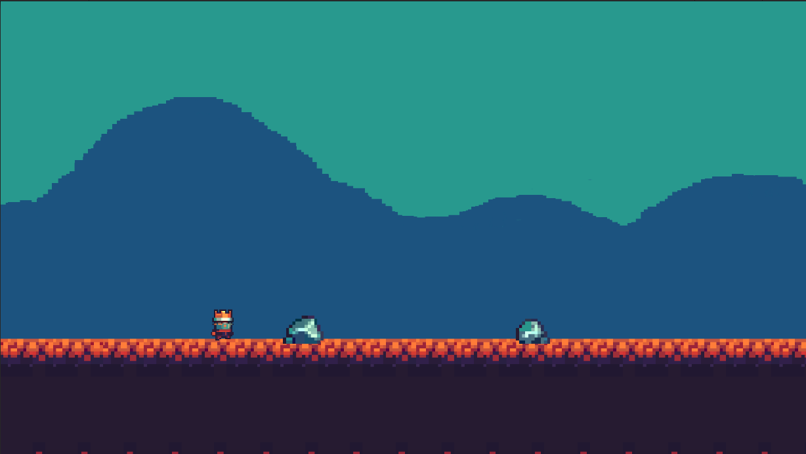

# Juego 2d en Unity (Endless Runner)

# Prueba el juego en Unity
El juego fue desarrollado en `Unity v.2022`. Es recomendable tener la misma versión para que todo funcione 

Para probar el juego puedes clonar el repositorio o descargarlo. 
1. En la parte de arriba a la derecha hay un botón que dice `Clonar o Descargar` Dale click y descarga el zip.
2. Descomprime el archivo.
3. Al descomprimir el archivo se genera un nueva carpeta. tienes que descargar el unity y Puedes abrir *Unity Hub* y seleccionar esa carpeta para abrir el juego.
4. a disfrutar
